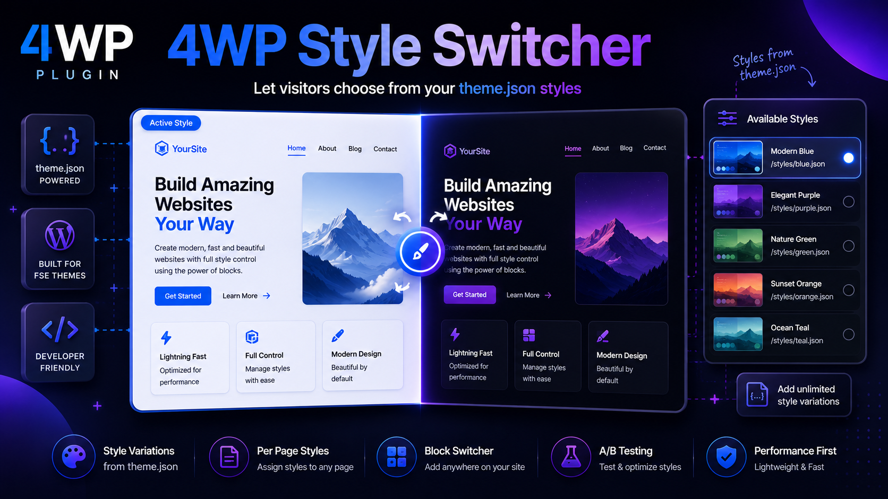
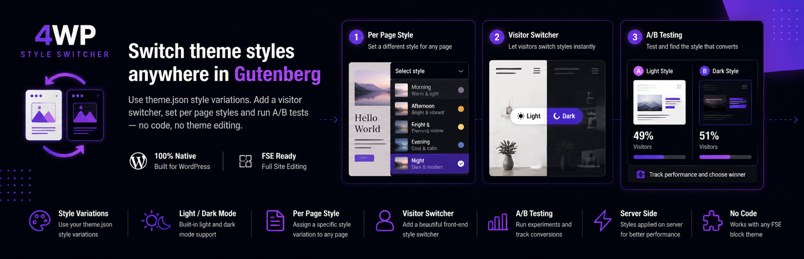

<p align="center">
  
</p>

# 4WP Style Switcher

Apply **theme.json style variations** per page, let visitors switch styles on the frontend, and add a **Light/Dark** toggle to the navigation menu (FSE block themes).



## Demo

[](https://www.youtube.com/watch?v=JDGOF2B2zqQ)

## Try it in WordPress Playground

**[Open live demo →](https://playground.wordpress.net/?blueprint-url=https://raw.githubusercontent.com/4wpdev/4wp-style-switcher/v1.0.0/.wordpress-org/assets/blueprints/blueprint.json)**

| Setting | Value |
|--------|--------|
| Theme | Twenty Twenty-Five |
| Allowed variations | Morning, Afternoon, Evening |
| Default style | Morning |
| Light / Dark | Morning ↔ Midnight |
| Frontend switcher | On (bottom right) |
| Menu | Light/Dark block in navigation |

## Requirements

- WordPress 6.4+
- Block theme with style variations in `/styles/`

## Development

```bash
cd wp-content/plugins/4wp-style-switcher
composer install
composer test
```

## Links

- [GitHub repository](https://github.com/4wpdev/4wp-style-switcher)
- [Releases](https://github.com/4wpdev/4wp-style-switcher/releases)

## License

GPL-2.0-or-later — see [LICENSE](LICENSE).
